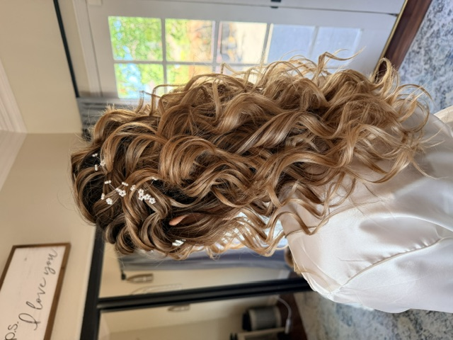

# Project - My First Portfolio 

Hello there! My name is **Anel Sarai**! I am a _**Hairdresser and Beginner Web Developer**_
This is my New Project on GitHub!

## Features to Come

- Fast and lightweight
- Responsive UI
- Fully configurable

## Installation
I built this using...

## The Problem 
what problem was the website designed to solve? Accessible Site for Beginners!

## Target Audience
who is the website intended for? Hairstylists and Beauty Professionals!

## Features 
- Responsive navigation
- Accesible Forms
- CSS Grid Layout
- Mobile First Design
  
## Technologies

- HTML

- CSS
 
- JavaScript 
 
- GitHub

## My Hairdresser Work 

For more hair content, check out my Instagram!
[Click Me!](https://www.instagram.com/blowdrybae)

## What I learned 
Learning Basic Coding and Web Development 
